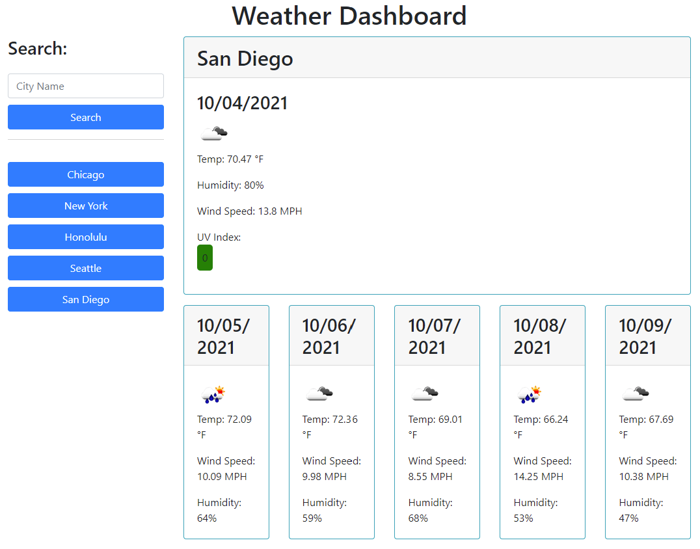

# Weather Dashboard

### Description

The purpose of this application is to allow a user to both search for the current weather and 5 day forecast of a particular city, and also re-visit previous searches via a search history section.  
This assignment was an interesting challenge as it required implementation of a wide variety of JavaScript functionality as well as gathering and presenting data from a server side API. 

I utalized HTML, Bootstrap, CSS, JavaScript, and the openweathermap one call API when creating this application. 

The deployed application can be accessed via the following link:
https://ericaleesnyder.github.io/weather-dashboard/

### Useage

Upon loading the web page, the user is presented with a search bar as well as buttons for any previously searched cities. The application then presents the user with not only a current conditions, but also a 5 day forecast. The current weather conditions display the date, a weather condition icon, temperature, humidity, wind speed, and a color coded UV index. Each of the five day forecasts include all of this information except for the UV index, as it is only relevant in real time. 

As the user searches for various cities, the cities are added to the search history. If the user searches for a city that is already in the search history (either by re-entering the name in the search bar or clicking on the button in the search history), no new button will be created. 

Search from search history:

New city search:
